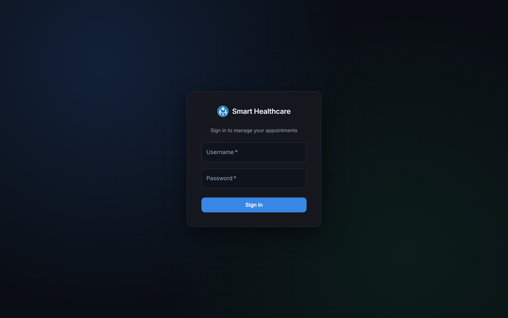
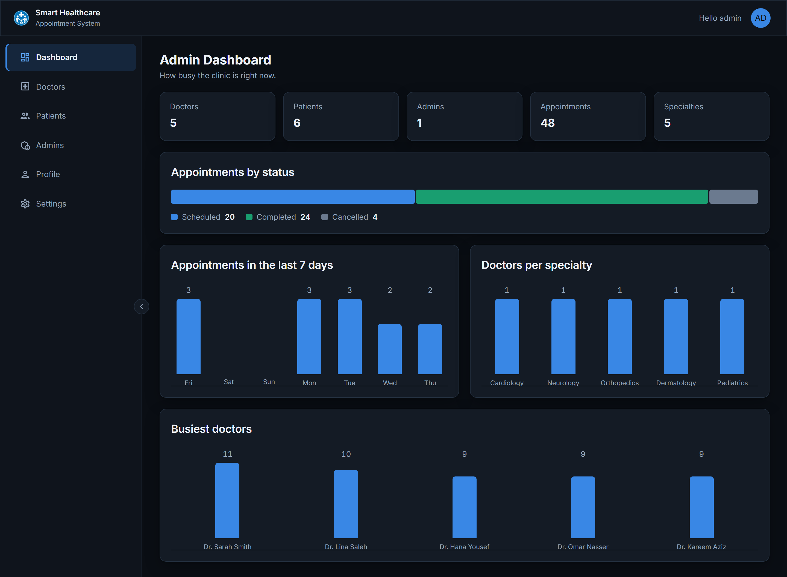
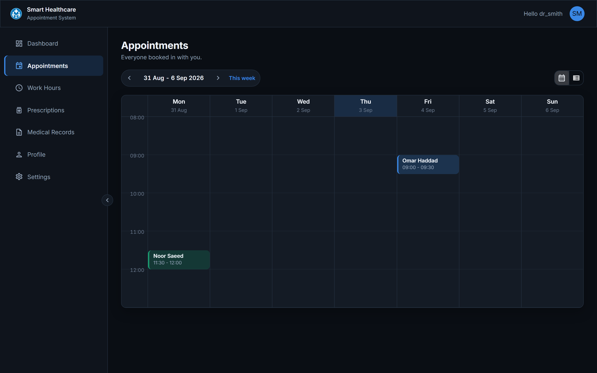
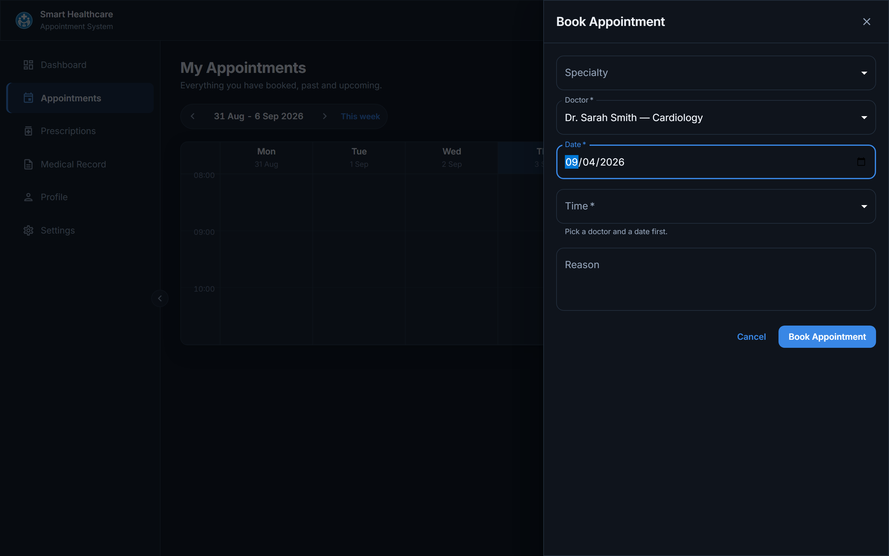
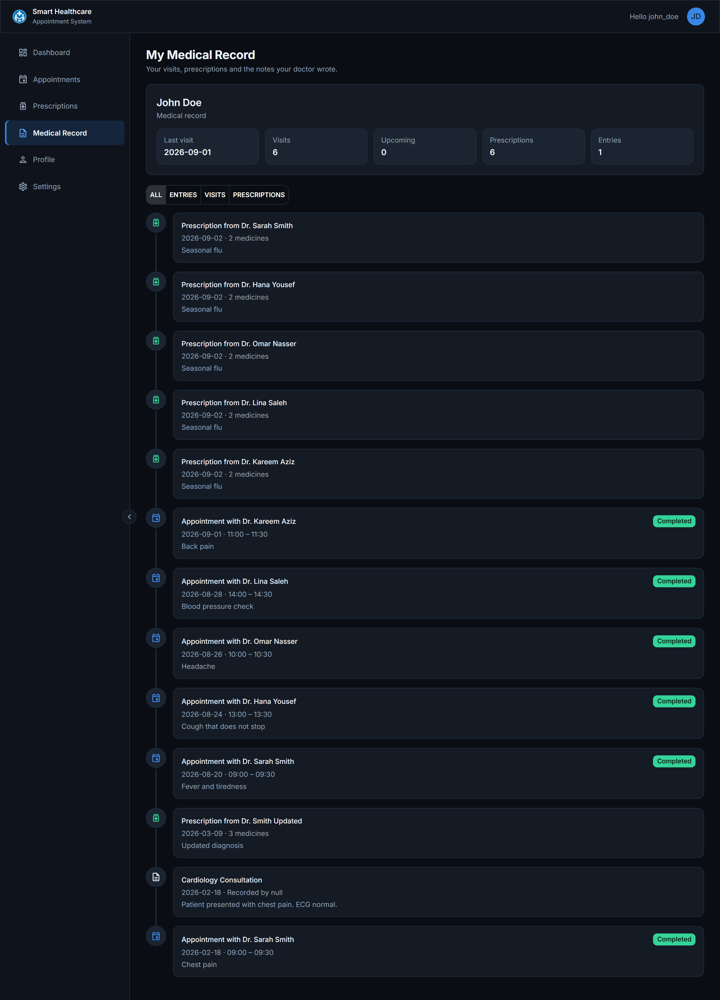

# 🏥 Smart Healthcare — Frontend

<div align="center">


The web client for the **Smart Healthcare Appointment System** — a role-aware dashboard where
admins manage the clinic, doctors run their schedule and write prescriptions, and patients book
visits and read their own medical record.

Built with **React 19**, **TypeScript**, **MUI v9** and **SCSS Modules**, protected by
**JWT route guards**, and covered end to end by **78 Playwright tests** that all run in parallel.

**Backend API:** [Smart-Healthcare-Appointment-System](https://github.com/khdour17/Smart-Healthcare-Appointment-System) — Spring Boot 4, MySQL + MongoDB, JWT.

</div>

---

## 📑 Table of Contents

- [Screens](#-screens)
- [Features by Role](#-features-by-role)
- [Tech Stack](#-tech-stack)
- [Architecture](#-architecture)
- [Project Structure](#-project-structure)
- [Routing & Guards](#-routing--guards)
- [Talking to the API](#-talking-to-the-api)
- [Styling Rules](#-styling-rules)
- [Reusable Components](#-reusable-components)
- [State & Data Loading](#-state--data-loading)
- [End-to-End Tests](#-end-to-end-tests)
- [Screenshot Script](#-screenshot-script)
- [Setup & Installation](#-setup--installation)
- [Docker](#-docker)
- [npm Scripts](#-npm-scripts)
- [Demo Accounts](#-demo-accounts)

---

## 📸 Screens

<div align="center">

### Sign in


### Admin dashboard


### Doctor schedule — week calendar


### Patient books a visit


### A patient's medical record


</div>

<details>
<summary><b>All 44 screens (click to open)</b></summary>

| # | Screen | File |
|---|--------|------|
| 01 | Login | `screenshots/01-login.png` |
| 02 | Login — wrong password | `screenshots/02-login-error.png` |
| 03 | Admin dashboard | `screenshots/03-admin-dashboard.png` |
| 04 | Admin — doctors | `screenshots/04-admin-doctors.png` |
| 05 | Admin — add doctor | `screenshots/05-admin-add-doctor.png` |
| 06 | Admin — rows selected | `screenshots/06-admin-selected-rows.png` |
| 07 | Admin — delete dialog | `screenshots/07-admin-delete-dialog.png` |
| 08 | Admin — patients | `screenshots/08-admin-patients.png` |
| 09 | Admin — admins | `screenshots/09-admin-admins.png` |
| 10 | Admin — profile (read only) | `screenshots/10-admin-profile.png` |
| 11 | Toast after booking | `screenshots/11-toast-after-booking.png` |
| 12 | Patient — appointments calendar | `screenshots/12-patient-appointments-calendar.png` |
| 13 | Patient — book appointment | `screenshots/13-patient-book-appointment.png` |
| 14 | Patient — appointments list | `screenshots/14-patient-appointments-list.png` |
| 15 | Patient — cancel dialog | `screenshots/15-patient-cancel-dialog.png` |
| 16 | Patient dashboard | `screenshots/16-patient-dashboard.png` |
| 17 | Patient — appointment details | `screenshots/17-patient-appointment-details.png` |
| 18 | Patient — prescriptions | `screenshots/18-patient-prescriptions.png` |
| 19 | Patient — prescription details | `screenshots/19-patient-prescription-details.png` |
| 20 | Patient — medical record | `screenshots/20-patient-medical-record.png` |
| 21 | Patient — record filtered | `screenshots/21-patient-record-filtered.png` |
| 22 | Patient — profile | `screenshots/22-patient-profile.png` |
| 23 | Patient — edit profile | `screenshots/23-patient-edit-profile.png` |
| 24 | Settings | `screenshots/24-settings.png` |
| 25 | Collapsed side menu | `screenshots/25-collapsed-menu.png` |
| 26 | User menu | `screenshots/26-user-menu.png` |
| 27 | Not found | `screenshots/27-not-found.png` |
| 28 | Mobile dashboard | `screenshots/28-mobile-dashboard.png` |
| 29 | Mobile menu | `screenshots/29-mobile-menu.png` |
| 30 | Doctor dashboard | `screenshots/30-doctor-dashboard.png` |
| 31 | Doctor — schedule calendar | `screenshots/31-doctor-schedule-calendar.png` |
| 32 | Doctor — schedule list | `screenshots/32-doctor-schedule-list.png` |
| 33 | Doctor — complete a visit | `screenshots/33-doctor-complete-appointment.png` |
| 34 | Doctor — add prescription | `screenshots/34-doctor-add-prescription.png` |
| 35 | Doctor — appointment details | `screenshots/35-doctor-appointment-details.png` |
| 36 | Doctor — work hours calendar | `screenshots/36-doctor-work-hours-calendar.png` |
| 37 | Doctor — work hours list | `screenshots/37-doctor-work-hours-list.png` |
| 38 | Doctor — add work hours | `screenshots/38-doctor-add-work-hours.png` |
| 39 | Doctor — prescriptions | `screenshots/39-doctor-prescriptions.png` |
| 40 | Doctor — edit prescription | `screenshots/40-doctor-edit-prescription.png` |
| 41 | Doctor — prescription details | `screenshots/41-doctor-prescription-details.png` |
| 42 | Doctor — medical records | `screenshots/42-doctor-medical-records.png` |
| 43 | Doctor — add record entry | `screenshots/43-doctor-add-record-entry.png` |
| 44 | Doctor — profile | `screenshots/44-doctor-profile.png` |

</details>

---

## 👥 Features by Role

The left menu, the routes and the API calls all follow the role in the JWT.

### 🛡 Admin

| Feature | Where |
|---------|-------|
| Clinic overview — counts, appointments by status, last 7 days, doctors per specialty | `/dashboard` |
| List, add and delete doctors | `/dashboard/doctors` |
| List, add and delete patients | `/dashboard/patients` |
| List, add and delete admins (never yourself) | `/dashboard/admins` |
| Delete several rows at once, with a confirm dialog that names the count | every list page |
| Read-only profile — an admin is changed by another admin | `/dashboard/profile` |

### 🩺 Doctor

| Feature | Where |
|---------|-------|
| Personal overview — today, upcoming, patients seen, hours per weekday | `/dashboard` |
| Week calendar or list of every appointment booked with him | `/dashboard/schedule` |
| Complete a visit and write the notes | `/dashboard/schedule` |
| Write, edit and delete a prescription for a completed visit | `/dashboard/schedule`, `/dashboard/prescribed` |
| Set the working days, hours and slot length | `/dashboard/availability` |
| Open any patient's record and add, edit or delete entries | `/dashboard/records` |
| Edit his own name and specialty | `/dashboard/profile` |

### 🙋 Patient

| Feature | Where |
|---------|-------|
| Personal overview — upcoming, completed, prescriptions, next visit | `/dashboard` |
| Book a visit: filter by specialty, pick a doctor, a date and a free slot | `/dashboard/appointments` |
| Week calendar or list of his own appointments | `/dashboard/appointments` |
| Cancel a scheduled visit, delete a cancelled one | `/dashboard/appointments` |
| Read every prescription written for him | `/dashboard/prescriptions` |
| Read his own medical record — visits, prescriptions and doctor notes on one timeline | `/dashboard/medical-record` |
| Edit his own name, date of birth, phone and address | `/dashboard/profile` |

### Shared by everyone

- **Profile** and **Settings** pages
- **Collapsible side menu** that remembers the choice
- **Calendar / list toggle** that remembers the choice per page
- **Toast notifications** on every create, update, cancel and delete
- **Responsive layout** — the side menu turns into a drawer under 900px

---

## 🛠 Tech Stack

| Layer | Choice | Why |
|-------|--------|-----|
| UI library | **React 19** | Function components and hooks only |
| Language | **TypeScript 6** (strict) | No `any`, no unused locals |
| Build | **Vite 8** | Fast dev server, hashed production assets |
| Components | **MUI v9** | Accessible primitives, no hand-rolled widgets |
| Styling | **SCSS Modules** + a small mixin library | Scoped class names, zero inline styles |
| Routing | **React Router 7** | Nested routes with guard elements |
| HTTP | **Axios** | One client with token and 401 interceptors |
| Auth | **jwt-decode** | Reads role and expiry out of the token |
| Testing | **Playwright** | 78 end-to-end tests, 4 workers |
| Serving | **nginx** (Docker) | Static files + `/api` proxy to the backend |

---

## 🏗 Architecture

```
┌──────────────────────────────────────────────────────────────┐
│                        Browser                               │
│                                                              │
│   AppRouter ──► RequireAuth ──► RequireRole ──► MainLayout    │
│                                                    │         │
│                                    Header · LeftMenu · Outlet │
│                                                    │         │
│                                                  Pages        │
│                                                    │         │
│                                 shared views + components     │
└────────────────────────────────┬─────────────────────────────┘
                                 │  axios (httpClient)
                                 │  Authorization: Bearer <jwt>
                                 ▼
                        nginx  /api  ──►  Spring Boot :8080
                                              │
                                    MySQL ────┴──── MongoDB
```

**The rules the codebase follows**

1. **A page never calls axios directly.** Every request lives in `src/api/<domain>/<Domain>API.ts`.
2. **A page never holds styling.** No inline `style`, no `sx` — every class lives in a `.module.scss` next to the component.
3. **A component is only shared when three pages need it.** MUI covers the rest.
4. **Anything repeated in two places moves into `src/utils` or a SCSS mixin.**

---

## 📁 Project Structure

```
src/
├── analytics/                 Pure functions that turn API data into chart points
│   ├── adminAnalytics.ts          busiest doctors, doctors per specialty
│   ├── appointmentAnalytics.ts    status share, last 7 days, upcoming
│   ├── doctorAnalytics.ts         weekly working hours
│   └── patientAnalytics.ts        visits per doctor
│
├── api/                       One file per backend domain, axios only lives here
│   ├── admin/AdminAPI.ts
│   ├── appointments/AppointmentsAPI.ts
│   ├── auth/LoginAPI.ts · RegisterAPI.ts
│   ├── availability/AvailabilityAPI.ts
│   ├── doctors/DoctorsAPI.ts
│   ├── medicalRecords/MedicalRecordsAPI.ts
│   ├── patients/PatientsAPI.ts
│   └── prescriptions/PrescriptionsAPI.ts
│
├── components/                Reusable UI, each with its own .module.scss
│   ├── BarChart/              Bar chart built from divs, no chart library
│   ├── CalendarToolbar/       Week navigation + calendar/list toggle
│   ├── ConfirmDialog/         Confirm before a destructive action
│   ├── DataTable/             Table with optional row selection
│   ├── Drawer/                Right-hand drawer that every form opens in
│   ├── PageHeader/            Title, subtitle and the page actions
│   ├── ShareBar/              Proportional bar with a legend
│   ├── StatTiles/             Row of labelled numbers
│   └── WeekCalendar/          Week grid that places items by real start time
│
├── contexts/                  AuthContext (user + token) and ToastContext
├── routes/                    AppRouter and the RequireAuth / RequireRole guards
├── styles/                    _variables, _mixins, _common, global
├── theme/                     MUI dark theme — only truly global overrides
├── types/                     Shared unions (AppointmentStatus, DayOfWeek)
│
├── utils/
│   ├── appointmentTone.ts     Appointment status → calendar colour
│   ├── authStorage.ts         Token in localStorage, session expiry
│   ├── byNewestFirst.ts · bySoonestFirst.ts   Sort helpers
│   ├── classNames.ts          Joins class names, skips falsy ones
│   ├── formatTime.ts · todayIso.ts · weekDates.ts
│   ├── getInitials.ts         Avatar initials
│   ├── httpClient.ts          The axios instance and its interceptors
│   ├── openNativePicker.ts    Opens the native date picker on click
│   ├── preferences.ts         Menu and per-page view choices
│   ├── useLatestCall.ts       Drops a response a newer call already replaced
│   ├── useLoadedData.ts       load / isLoading / error / reload in one hook
│   └── useToast.ts            Shortcut into ToastContext
│
└── views/
    ├── layouts/MainLayout/    Header, LeftMenu, mobile drawer, Outlet
    ├── pages/
    │   ├── Admin/             DashboardPage, DoctorsPage, PatientsPage, AdminsPage
    │   ├── Doctor/            DashboardPage, SchedulePage, WorkHoursPage,
    │   │                      PrescriptionsPage, MedicalRecordsPage
    │   ├── Patient/           DashboardPage, AppointmentsPage,
    │   │                      PrescriptionsPage, MedicalRecordsPage
    │   ├── LoginPage/
    │   └── NotFoundPage/
    └── shared/                Views more than one role renders
        ├── AppointmentDetails/    Visit + its prescription
        ├── AppointmentStatusChip/ Scheduled · Completed · Cancelled
        ├── PatientRecord/         Summary + filterable timeline
        ├── PrescriptionDetails/   Diagnosis, medicines, instructions
        ├── PrescriptionForm/      Create and edit a prescription
        ├── ProfilePage/           Profile for all three roles
        ├── SettingsPage/          Session details and the menu preference
        └── UserListPage/          The list page behind doctors/patients/admins
```

---

## 🧭 Routing & Guards

Every page is lazy loaded, so a role only downloads the screens it can open.

| Path | Who | Page |
|------|-----|------|
| `/login` | everyone | Sign in |
| `/dashboard` | any signed-in user | Admin, Doctor or Patient dashboard by role |
| `/dashboard/profile` | any signed-in user | Profile |
| `/dashboard/settings` | any signed-in user | Settings |
| `/dashboard/doctors` | `ADMIN` | Doctors |
| `/dashboard/patients` | `ADMIN` | Patients |
| `/dashboard/admins` | `ADMIN` | Admins |
| `/dashboard/schedule` | `DOCTOR` | Appointments booked with him |
| `/dashboard/availability` | `DOCTOR` | Work hours |
| `/dashboard/prescribed` | `DOCTOR` | Prescriptions he wrote |
| `/dashboard/records` | `DOCTOR` | Any patient's record |
| `/dashboard/appointments` | `PATIENT` | His appointments |
| `/dashboard/prescriptions` | `PATIENT` | His prescriptions |
| `/dashboard/medical-record` | `PATIENT` | His record |
| anything else | everyone | 404 |

**`RequireAuth`** sends a visitor with no valid token to `/login`.
**`RequireRole`** sends a signed-in user who opens someone else's page back to `/dashboard` —
so typing an admin URL as a patient never shows admin data, not even for a frame.

---

## 🔌 Talking to the API

`src/utils/httpClient.ts` is the only axios instance in the app.

```ts
const api = axios.create({ baseURL: '/api' });

// Every request carries the token
api.interceptors.request.use((config) => { /* Authorization: Bearer <token> */ });

// A 401 on anything except the login call means the session died:
// drop the token and go back to /login
api.interceptors.response.use(response => response, (error) => { /* ... */ });
```

`baseURL` is a relative `/api`, so the same build works in every environment:

- **`npm run dev`** — Vite proxies `/api` to `http://localhost:8080`
- **Docker** — nginx proxies `/api` to `http://healthcare-app:8080/api/`

Each domain file exports typed request and response models plus the calls, for example:

```ts
export async function getAvailableSlots(doctorId: number, date: string): Promise<AvailableSlotResponse[]>
export async function bookAppointment(patientId: number, request: AppointmentRequest): Promise<AppointmentResponse>
export async function cancelAppointment(appointmentId: number): Promise<void>
```

---

## 🎨 Styling Rules

- **No inline styles and no `sx` prop.** Every rule lives in the `.module.scss` beside the component.
- **`:global()`** is used to reach MUI internals from a scoped module.
- **`src/styles/_variables.scss`** holds the palette, radii, shadows and breakpoints.
- **`src/styles/_mixins.scss`** holds the patterns that repeat across pages, so a rule is written once:

| Mixin | What it lays out |
|-------|------------------|
| `page-column` | The vertical page stack every screen uses |
| `panel-section` | A raised card section |
| `drawer-form` / `tall-drawer-form` | The form and the actions row inside a drawer |
| `details-panel` | The shared appointment / prescription details layout |
| `row-actions` | The icon buttons at the end of a table row |
| `selection-bar` | The bar that replaces the page action while rows are selected |
| `charts-grid` | The responsive dashboard chart grid |
| `danger-action` / `quiet-danger-action` | Destructive icon buttons |
| `summary-card`, `fill-height-field`, `centered-message`, `page-message` | Smaller repeats |

Only genuinely app-wide defaults live in `src/theme/theme.ts` (the dark palette, button shape,
input borders, table head styling) — everything single-use stays in its own module.

---

## 🧩 Reusable Components

A component earns its place only when several unrelated pages need it. Everything else is MUI.

| Component | Used by |
|-----------|---------|
| `DataTable` | every list screen — admin lists, appointments, prescriptions, work hours |
| `Drawer` | every create / edit / details panel |
| `ConfirmDialog` | every destructive action |
| `PageHeader` | every page, including the three dashboards |
| `WeekCalendar` | doctor schedule, doctor work hours, patient appointments |
| `CalendarToolbar` | the three pages above |
| `StatTiles` | three dashboards, profile, settings, record summary |
| `BarChart`, `ShareBar` | the three dashboards |

---

## 🔄 State & Data Loading

There is no state library. Data lives in the page that shows it, and two small hooks remove the
repetition that used to sit in five pages:

**`useLoadedData(load, errorMessage)`** returns `{ data, isLoading, error, reload }`. It replaces
the `useState` + `useCallback` + `useEffect` + `catch` + `finally` block each page used to repeat.

**`useLatestCall()`** guards against out-of-order responses. A page can have two loads in flight
at once — the one that runs on mount and the one that runs after a create or a delete. Without a
guard the slower first response lands last and puts the stale list back on screen, so a doctor
you just added disappears until you reload. `useLatestCall` hands out a token per call and the
page only applies the response that is still the newest.

```ts
const startRowsCall = useLatestCall();

const refreshRows = useCallback(() => {
  const isLatestCall = startRowsCall();
  loadAll().then((loaded) => {
    if (isLatestCall()) setRows(loaded);
  });
}, [loadAll, startRowsCall]);
```

Two small preferences are kept in `localStorage` through `src/utils/preferences.ts`: whether the
side menu stays collapsed, and whether a page opens in calendar or list view.

---

## 🧪 End-to-End Tests

**78 Playwright tests, all green, running on 4 workers in about 3.5 minutes.**

```
tests/
├── config/
│   ├── app.config.ts        BASE_URL and every route
│   └── messages.ts          Every button, label, toast and error text
├── fixtures/testFixtures.ts adminPage · commonPage · doctorPage · loginPage · patientPage
├── pages/
│   ├── CommonPage.ts        Generic verbs: clickOnItem, fillForm, verifyToast, verifyAlert…
│   ├── AdminPage.ts         addUser, deleteRows, removeCreatedUsers
│   ├── DoctorPage.ts        addWorkHours, completeAppointment, fillPrescription, addRecordEntry…
│   ├── PatientPage.ts       bookAppointment, cancelAppointment, removeAppointment…
│   └── LoginPage.ts         login, loginAs
├── selectors/               Every selector, never inline in a spec
├── testData/
│   ├── common.data.ts       Users, people, menus per role, uniqueText
│   ├── admin.data.ts        newDoctor, newPatient, newAdmin
│   ├── doctor.data.ts       Work hours, prescriptions, record entries
│   └── patient.data.ts      Booking dates, reasons, profile values
├── screenshots/             The screenshot script (not part of the suite)
└── specs/
    ├── login.spec.ts        TC-001…TC-016   sign in, sign out, session, menu per role
    ├── admin.spec.ts        TC-017…TC-034   doctors, patients, admins, bulk delete
    ├── doctor.spec.ts       TC-035…TC-052   work hours, schedule, records, prescriptions
    ├── patient.spec.ts      TC-053…TC-070   booking, cancelling, record, profile
    ├── shared.spec.ts       TC-071…TC-077   dashboards, profile, settings, menu
    └── journey.spec.ts      TC-078          one visit across all three roles
```

### How the suite is built

- **Pre-defined logins.** `admin`, `dr_smith` and `john_doe` already exist; a test never creates
  the user it signs in as.
- **Every test is a full cycle.** It creates what it needs, verifies it, and removes it — which is
  what makes running them in parallel safe.
- **Nothing is left behind.** Users a test creates are deleted in an `after` step, so the cleanup
  still runs when the test fails halfway. A run leaves the database exactly as it found it.
- **Parallel safety by ownership, not luck.** The work-hours tests own Saturday and Sunday, each
  booking test owns its own Monday weeks ahead and takes the first free slot, and every created
  row carries a unique title, reason or diagnosis.
- **Everything goes through the UI.** There is no API helper that reaches around the app.
- **Selectors live in `tests/selectors`,** never inside a spec, and every alert is asserted by its
  message, not just by "an alert appeared".

### The journey test

`journey.spec.ts` follows a single visit across all three roles: the admin adds a patient, that
patient books, the doctor completes the visit and writes a prescription, the patient reads it in
his list and on his record timeline, then the doctor edits the diagnosis and deletes it. Because a
completed visit cannot be undone, the test makes its own patient and the `after` step deletes him —
which takes the appointment with him and leaves nothing behind.

### Running them

```bash
# Against the Docker stack (recommended)
BASE_URL=http://localhost:5173 npm run test:e2e

# Against a dev server Playwright starts for you
npm run test:e2e

# Interactive UI mode
npm run test:e2e:ui

# Open the HTML report of the last run
npm run test:e2e:report
```

Inside Docker:

```bash
docker compose run --rm tests      # one run, exits 0 or 1
docker compose up -d tests-ui      # http://localhost:9323
```

The full list of cases, with prerequisites, steps, data and expected results, is in
[`test-cases/test-cases.xlsx`](test-cases/test-cases.xlsx).

---

## 📷 Screenshot Script

Every image in this README is produced by a script, so they never drift from the app.

```bash
BASE_URL=http://localhost:5173 npm run screenshots
```

It signs in as each role and walks the whole app with the same page objects the tests use,
writing 44 PNGs into `screenshots/`. It captures at 1440×900 on a 2× device scale, grows the
viewport to fit pages that scroll, and moves the pointer away first so no tooltip is left hanging.

Like the test suite it cleans up after itself: the admin creates one patient, that patient books
the visits the calendars need, and the `after` step deletes him again.

---

## ⚙ Setup & Installation

### Prerequisites

- **Node.js 22+** and npm
- The **backend** running on `http://localhost:8080` —
  see [Smart-Healthcare-Appointment-System](https://github.com/khdour17/Smart-Healthcare-Appointment-System)

### Install and run

```bash
git clone https://github.com/khdour17/smart-healthcare-frontend.git
cd smart-healthcare-frontend
npm install
npm run dev
```

The app opens on `http://localhost:5173`. Vite proxies `/api` to the backend on port 8080.

### Install the browsers Playwright needs (first time only)

```bash
npx playwright install --with-deps chromium
```

---

## 🐳 Docker

The frontend image is a two-stage build: Node compiles the app, then nginx serves the static files
and proxies `/api` to the backend container. The final image is around 80 MB and contains no source.

> **Start the backend stack first.** It creates the `healthcare-network` this compose file joins.

```bash
# 1. Backend (from the backend repository)
docker compose up -d --build

# 2. Frontend (from this repository)
docker compose up -d --build web
```

| Container | Image | Port |
|-----------|-------|------|
| `healthcare-web` | built from `Dockerfile` (node → nginx) | `5173 → 80` |
| `healthcare-tests` | built from `Dockerfile.tests` | runs the suite once |
| `healthcare-tests-ui` | built from `Dockerfile.tests` | `9323 → 9323` |

| URL | What |
|-----|------|
| `http://localhost:5173` | The app |
| `http://localhost:8080/api` | The backend API |
| `http://localhost:9323` | Playwright UI mode |

```bash
docker compose down          # stop
docker compose up -d --build web   # rebuild after a code change
```

---

## 📜 npm Scripts

| Script | What it does |
|--------|--------------|
| `npm run dev` | Vite dev server on port 5173 with `/api` proxied to 8080 |
| `npm run build` | Type-checks the app and builds into `dist/` |
| `npm run preview` | Serves the production build locally |
| `npm run lint` | ESLint over the whole repository |
| `npm run typecheck:tests` | Type-checks the Playwright project |
| `npm run test:e2e` | Runs the 78 end-to-end tests |
| `npm run test:e2e:ui` | Playwright UI mode |
| `npm run test:e2e:report` | Opens the HTML report of the last run |
| `npm run screenshots` | Regenerates every image in `screenshots/` |

---

## 🔑 Demo Accounts

| Role | Username | Password |
|------|----------|----------|
| Admin | `admin` | `admin123` |
| Doctor | `dr_smith` | `doctor123` |
| Patient | `john_doe` | `patient123` |

The admin is seeded by the backend on first start. Doctors and patients are created from the
admin screens.

---

<div align="center">

**Frontend for the [Smart Healthcare Appointment System](https://github.com/khdour17/Smart-Healthcare-Appointment-System)**

</div>
